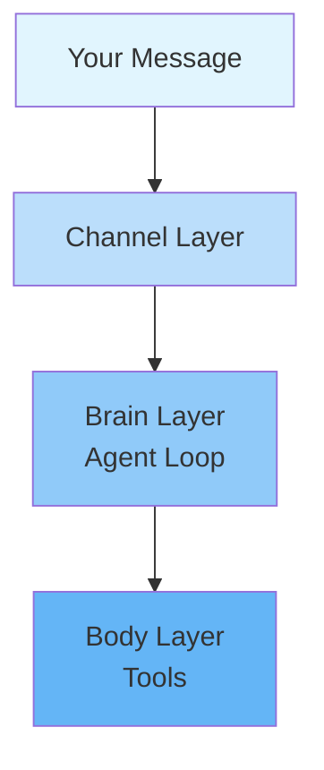

# From Chatbot to Co-worker
## Building and Using AI Agents

<div class="pt-12">
  <span @click="$slidev.nav.next" class="px-2 py-1 rounded cursor-pointer" hover="bg-white bg-opacity-10">
    Press Space for next page <carbon:arrow-right class="inline"/>
  </span>
</div>

---
layout: two-cols
---

# Agenda

<Timeline>

- **Part 01**: What is an AI Agent?
- **Part 02**: Evolution Path from Prompt to Agent
- **Part 03**: How to Use Agents Effectively?
- **Part 04**: Security Awareness

</Timeline>

::right::

<div class="pl-8">

<v-clicks>

**You will learn**

- What is an AI Agent
- From asking questions to letting AI do work
- Agent usage techniques
- How to build your own Agent

</v-clicks>

</div>

---
layout: center
class: text-center
---

# Part 01

## What is an AI Agent?

---
layout: center
class: text-center
---

# From "Chatbot" to "AI That Can Do Work"

<div class="text-2xl opacity-80 mt-8">
Have you used AI tools before?
</div>

---
layout: center
---

# Conversational AI vs AI Agent

<div class="grid grid-cols-2 gap-8 pt-8">

<div class="text-center">

<v-clicks>

### 🗣️ Conversational AI (Chat AI)

**Q&A Mode**

You ask a question

It gives an answer

Then you execute it yourself

</v-clicks>

</div>

<div class="text-center">

<v-clicks>

### 🤖 AI Agent

**Agent Mode**

You state a goal

It plans itself

It executes itself

It provides feedback

</v-clicks>

</div>

</div>

---
layout: center
---

# What is an AI Agent?

<div class="pt-8">

Three Core Capabilities of AI Agents:

<div class="grid grid-cols-3 gap-6 mt-8">

<div class="text-center p-4 rounded-lg bg-blue-500 bg-opacity-10">

<div class="text-4xl mb-2">👁️</div>

### Perception

Read files, emails, web pages, calendars, and other external information

</div>

<div class="text-center p-4 rounded-lg bg-green-500 bg-opacity-10">

<div class="text-4xl mb-2">🧠</div>

### Planning

Break down large goals into multi-step tasks

</div>

<div class="text-center p-4 rounded-lg bg-purple-500 bg-opacity-10">

<div class="text-4xl mb-2">🦾</div>

### Execution

Operate tools—send emails, run code, control browsers

</div>

</div>

<div class="mt-12 p-6 bg-yellow-500 bg-opacity-20 rounded-lg">

**AI Agent = LLM Brain + Tools + Memory System**

</div>

</div>

---
layout: center
---

# Three-Layer Architecture of Agents

<div class="pt-8">



<div class="text-left mt-8 text-sm opacity-80">

- **Channel Layer**: Unified message reception from various platforms
- **Brain Layer**: Understand goal → Plan steps → Call tools
- **Body Layer**: File read/write / Code execution / Browser control / Email sending

</div>

</div>

---
layout: center
---

# Coding Agent and Agentic AI

<div class="pt-8 grid grid-cols-2 gap-8">

<div class="p-6 rounded-lg bg-blue-500 bg-opacity-10">

### 💻 Coding Agent

<div class="text-left mt-4 opacity-80">
Focus on software development scenarios

- Read code
- Write code
- Run tests
- Submit PRs
</div>

<div class="mt-4 text-sm">
Examples: Claude Code, Cursor, Devin, GitHub Copilot Agent
</div>

</div>

<div class="p-6 rounded-lg bg-green-500 bg-opacity-10">

### 🌐 Agentic AI

<div class="text-left mt-4 opacity-80">
Broader business and life scenarios

- Research
- Book flights
- Generate reports
- Send emails
</div>

<div class="mt-4 text-sm">
Examples: ChatGPT Agent, Manus, Claude Cowork, OpenClaw
</div>

</div>

</div>

<div class="mt-8 p-4 bg-yellow-500 bg-opacity-20 rounded-lg text-center">

**Common Point: From "Answering Questions" to "Completing Tasks"**

</div>

---
layout: center
class: text-center
---

# Part 02

## Evolution Path from Prompt to Agent

---
layout: center
---

# Four Stages

<div class="pt-8">

<div class="grid grid-cols-4 gap-4 text-center">

<div class="p-4 rounded-lg bg-blue-500 bg-opacity-10">

### Stage 1

**Asker**

Single-turn dialogue

</div>

<div class="p-4 rounded-lg bg-green-500 bg-opacity-10">

### Stage 2

**Instructor**

Multi-turn + Prompt design

</div>

<div class="p-4 rounded-lg bg-yellow-500 bg-opacity-10">

### Stage 3

**Tool User**

LLM + Tools

</div>

<div class="p-4 rounded-lg bg-purple-500 bg-opacity-10">

### Stage 4

**Agent User**

Autonomous planning

</div>

</div>

</div>

---
layout: center
---

# Comparison of Four Stages

<div class="pt-8">

| Stage | Approach | What You Do | What AI Does |
|-------|----------|-------------|--------------|
| **Stage 1** | Single-turn dialogue | Ask questions | Give answers |
| **Stage 2** | Multi-turn + Prompt design | Write clear requirements, provide context | Generate content, provide suggestions |
| **Stage 3** | LLM + Tools | Describe goals, select tools | Call tools, process results |
| **Stage 4** | Autonomous planning + Multi-step execution | Provide goals and constraints | Autonomous breakdown, execution, feedback |

</div>

---
layout: center
---

# Core Transitions of Each Stage

<div class="pt-8">

<div class="space-y-4">

<div class="p-4 rounded-lg bg-blue-500 bg-opacity-10">

### Stage 1 → 2

From "Asking Randomly" to "Knowing How to Ask"

Learn to give AI sufficient context and constraints

</div>

<div class="p-4 rounded-lg bg-green-500 bg-opacity-10">

### Stage 2 → 3

From "Chatting" to "Doing Work"

Let AI connect to real tools, not just generate text

</div>

<div class="p-4 rounded-lg bg-yellow-500 bg-opacity-10">

### Stage 3 → 4

From "Single-step Execution" to "Autonomous Completion"

Hand goals to Agent instead of watching every step yourself

</div>

</div>

</div>

---
layout: center
class: text-center
---

# Which Stage Are You At?

<div class="pt-8 text-2xl opacity-80">

Most people are stuck between Stage 1-2

</div>

<div class="mt-12 p-8 bg-purple-500 bg-opacity-20 rounded-lg max-w-4xl mx-auto">

What truly unleashes Agent value is mastering the **Stage 3 and Stage 4** mindset

</div>

<div class="mt-8 text-xl opacity-60">

Not letting AI write words for you, but letting AI do things for you

</div>

---
layout: center
class: text-center
---

# Part 03

## How to Use Agents Effectively?

---
layout: center
---

# Technique 1: Issue "Tasks" Not "Questions"

<div class="pt-8">

Most people are used to asking AI questions

But Agents need:

<div class="grid grid-cols-4 gap-4 mt-8">

<div class="p-4 rounded-lg bg-blue-500 bg-opacity-10 text-center">

### 🎯 Goal

</div>

<div class="p-4 rounded-lg bg-green-500 bg-opacity-10 text-center">

### 📋 Context

</div>

<div class="p-4 rounded-lg bg-yellow-500 bg-opacity-10 text-center">

### 🔧 Constraints

</div>

</div>

</div>

---
layout: center
---

# Ineffective vs Effective Instructions

<div class="pt-4">

| Ineffective Instruction | Effective Instruction |
|------------------------|----------------------|
| "Help me write an email" | "Send an email on my behalf to Professor Zhang, explaining my thesis defense next Wednesday, requesting his feedback before 3 PM Tuesday, tone formal but friendly" |
| "Check some information" | "Search for the top three domestic AI news stories this week, compile into a 200-word summary, send to my WeChat" |
| "Help me manage schedule" | "Send me a daily schedule reminder at 8 AM, if there are 3+ tasks, prioritize by importance" |

</div>

---
layout: center
---

# GTCA Instruction Structure

<div class="pt-8">

<div class="grid grid-cols-4 gap-6">

<div class="text-center p-6 rounded-lg bg-blue-500 bg-opacity-10">

<div class="text-5xl mb-2">G</div>

### Goal

What is the goal

</div>

<div class="text-center p-6 rounded-lg bg-green-500 bg-opacity-10">

<div class="text-5xl mb-2">T</div>

### Tools

Which tools can be used

</div>

<div class="text-center p-6 rounded-lg bg-yellow-500 bg-opacity-10">

<div class="text-5xl mb-2">C</div>

### Context

Background information

</div>

<div class="text-center p-6 rounded-lg bg-purple-500 bg-opacity-10">

<div class="text-5xl mb-2">A</div>

### Action

Expected output format

</div>

</div>

</div>

---
layout: center
---

# Technique 2: Let AI Learn to Use Tools

<div class="pt-8">

<div class="grid grid-cols-2 gap-8">

<div class="p-6 rounded-lg bg-blue-500 bg-opacity-10">

### 🔌 MCP Tools

<div class="text-left mt-4">
- Open standard
- Connect external tools and data sources
- GitHub, Notion, Slack...
</div>

</div>

<div class="p-6 rounded-lg bg-green-500 bg-opacity-10">

### 📦 Skills

<div class="text-left mt-4">
- Reusable capability packages
- Encapsulate methodologies
- PPT creation, financial report analysis...
</div>

</div>

</div>

</div>

---
layout: center
---

# MCP: Model Context Protocol

<div class="pt-8">

<div class="max-w-4xl mx-auto">

<div class="p-8 bg-blue-500 bg-opacity-10 rounded-lg">

**MCP is to AI what USB-C is to hardware**

</div>

<div class="mt-8 grid grid-cols-2 gap-8">

<div>

### Core Features

- **Unified Interface**: One protocol connects everything
- **Plug and Play**: No need to write integration logic
- **Open Standard**: Proposed by Anthropic

</div>

<div>

### Common MCP Servers

- GitHub
- Notion
- Slack
- Linear
- Figma
- Databases
- File systems

</div>

</div>

</div>

</div>

---
layout: center
---

# Skills: Reusable Capability Packages

<div class="pt-8">

<div class="max-w-4xl mx-auto">

<div class="p-6 bg-green-500 bg-opacity-10 rounded-lg mb-6">

A Skill = Documentation (SKILL.md) + Optional scripts/templates/resources

</div>

<div class="grid grid-cols-2 gap-6">

<div>

### Features

- Loaded on demand, doesn't occupy main context
- Composable, shareable, versionable
- Encapsulates professional knowledge

</div>

<div>

### Typical Examples

- PPT creation
- PDF processing
- Financial report analysis
- Brand style writing
- Data visualization

</div>

</div>

</div>

</div>

---
layout: center
---

# MCP vs Skills

<div class="pt-8">

<div class="grid grid-cols-2 gap-8">

<div class="p-8 rounded-lg bg-blue-500 bg-opacity-10">

### 🔌 MCP

**Channel to External Tools**

<div class="mt-4 text-left">
- Connect real systems
- Call external APIs
- Access data sources
</div>

</div>

<div class="p-8 rounded-lg bg-green-500 bg-opacity-10">

### 📦 Skills

**Encapsulated Methodologies**

<div class="mt-4 text-left">
- Knowledge and processes
- Best practices
- Work patterns
</div>

</div>

</div>

</div>

---
layout: center
---

# How to Use Skills Effectively

<div class="pt-8">

<div class="grid grid-cols-2 gap-6">

<div class="p-4 rounded-lg bg-blue-500 bg-opacity-10">

### 🎯 Focus on Single Scenario

One Skill should solve only one type of problem

</div>

<div class="p-4 rounded-lg bg-green-500 bg-opacity-10">

### 📝 Write Clear Triggers

Specify "when to use it"

</div>

<div class="p-4 rounded-lg bg-yellow-500 bg-opacity-10">

### 🔗 Good at Composition

Chain together for complex tasks

</div>

<div class="p-4 rounded-lg bg-purple-500 bg-opacity-10">

### 📦 Start with Templates

Reuse official or community Skills

</div>

</div>

</div>

---
layout: center
---

# Create Your Own Skills

<div class="pt-8">

<div class="p-6 bg-yellow-500 bg-opacity-20 rounded-lg max-w-4xl mx-auto mb-8">

**The greatest value of Skills is not using others', but encoding your own workflow**

</div>

<div class="text-left max-w-3xl mx-auto">

```
my-skill/
├── SKILL.md          ← Required: triggers + steps + output format
├── template.md       ← Optional: output template
└── example.txt       ← Optional: reference example
```

</div>

</div>

---
layout: center
---

# SKILL.md Four-Section Format

<div class="pt-4 text-left max-w-4xl mx-auto">

```markdown
## When to use
Trigger this Skill when users need to write weekly work reports.

## Goal
Generate a clear, focused weekly report suitable for sending to direct supervisors.

## Steps
1. Ask what was accomplished this week
2. Ask about next week's plans and current blockers
3. Organize into three sections: achievements / plans / support needed
4. Formal tone, max 3 items per section, start with verbs

## Output format
Markdown with headings, under 300 words total
```

</div>

---
layout: center
---

# Three-Step Quick Start

<div class="pt-8">

<div class="space-y-6">

<div class="p-6 rounded-lg bg-blue-500 bg-opacity-10">

### Step 1: Find Repetitive Tasks

Identify something you do repeatedly every week

<div class="opacity-70 mt-2">
Reports, meeting notes, follow-up emails...
</div>

</div>

<div class="p-6 rounded-lg bg-green-500 bg-opacity-10">

### Step 2: Break Down Prompts

Copy your usual prompts

<div class="opacity-70 mt-2">
Break into "triggers + steps + output format"
</div>

</div>

<div class="p-6 rounded-lg bg-yellow-500 bg-opacity-10">

### Step 3: Test and Iterate

Save as SKILL.md

<div class="opacity-70 mt-2">
Load in Claude, run once, refine based on output
</div>

</div>

</div>

</div>

---
layout: center
---

# Suitable Skill Customization Scenarios

<div class="pt-8">

| Scenario | Skill Name | Core Value |
|----------|-----------|------------|
| Weekly reports | weekly-report | Consistent style, save formatting time |
| Meeting notes | meeting-notes | Auto-extract action items |
| Email drafting | email-drafter | Maintain your tone and signature style |
| Competitor analysis | competitor-research | Fixed analysis framework, comparable output |
| Reading/article summaries | article-summary | Consistent summary structure, easy to archive |

</div>

---
layout: center
---

# Technique 3: Instruction / Rule

<div class="pt-8">

<div class="max-w-4xl mx-auto">

<div class="p-6 bg-purple-500 bg-opacity-10 rounded-lg mb-8">

If Skills are "giving Agent an operations manual"

Then Instruction / Rule is "setting Agent boundaries"

</div>

<div class="grid grid-cols-2 gap-6">

<div class="p-4 rounded-lg bg-blue-500 bg-opacity-10">

### Instruction

<div class="text-left mt-2">
Tell Agent who it is and what its goals are
</div>

Focus on identity and role setting

</div>

<div class="p-4 rounded-lg bg-green-500 bg-opacity-10">

### Rule

<div class="text-left mt-2">
Constrain Agent's behavioral boundaries
</div>

Focus on "what can/cannot be done"

</div>

</div>

</div>

</div>

---
layout: center
---

# Five Common Rule Types

<div class="pt-8">

| Type | Example |
|------|---------|
| **Identity Setting** | "You are my personal work assistant named Xiao Bai, familiar with my work habits" |
| **Language Style** | "Reply in Chinese, keep technical terms in English, concise without fluff" |
| **Output Format** | "Give conclusions first, then reasons, max three points, numbered" |
| **Behavioral Boundaries** | "Don't send external messages proactively, must tell me content first" |
| **Priority Logic** | "If I say 'urgent', skip analysis and give executable solution directly" |

</div>

---
layout: center
---

# Complete Instruction Example

<div class="pt-4 text-left max-w-4xl mx-auto">

```
You are my personal productivity assistant named Xiao Bai.

【Role】
You understand my work background (product manager, B2B SaaS products),
familiar with my daily workflow including PRD writing, competitive analysis, weekly meeting preparation.

【Style】
- Reply in Chinese, concise and direct, no "sure" or "no problem" opening
- Keep technical terms in English (like API, DAU, MRR)
- Keep replies under 200 words unless I ask for detail

【Boundaries】
- For external operations like sending emails or submitting docs, must list content for confirmation first
- Don't proactively recommend paid tools or services

【Priority】
- When I say "urgent", give solution directly, skip analysis
- When I say "detail", expand all details and rationale
```

</div>

---
layout: center
---

# Four Principles for Good Rules

<div class="pt-8">

<div class="grid grid-cols-2 gap-6">

<div class="p-6 rounded-lg bg-blue-500 bg-opacity-10">

### 1️⃣ Specific Over Abstract

"Reply briefly" is worse than "Reply under 150 words"

</div>

<div class="p-6 rounded-lg bg-green-500 bg-opacity-10">

### 2️⃣ Positive Description

Say "only do X" is more effective than "don't do Y"

</div>

<div class="p-6 rounded-lg bg-yellow-500 bg-opacity-10">

### 3️⃣ Don't Be Greedy

5 precise rules > 20 vague requirements

</div>

<div class="p-6 rounded-lg bg-purple-500 bg-opacity-10">

### 4️⃣ Adjust as Needed

Update iteratively based on usage patterns

</div>

</div>

</div>

---
layout: center
class: text-center
---

# Part 04

## Security Awareness

---
layout: center
---

# Three Security Principles

<div class="pt-8">

<div class="space-y-6">

<div class="p-8 rounded-lg bg-red-500 bg-opacity-10 border-2 border-red-500">

### 🔐 Principle of Least Privilege

<div class="text-xl mt-2">
Only give Agent the permissions it truly needs

</div>

</div>

<div class="p-8 rounded-lg bg-yellow-500 bg-opacity-10 border-2 border-yellow-500">

### 🧪 Test with Low Risk First

<div class="text-xl mt-2">
Test with insensitive tasks before granting higher permissions

</div>

</div>

<div class="p-8 rounded-lg bg-blue-500 bg-opacity-10 border-2 border-blue-500">

### 🔍 Regular Audits

<div class="text-xl mt-2">
Check what Agent is doing, don't leave it completely unattended

</div>

</div>

</div>

</div>

---
layout: center
class: text-center
---

# Summary

<div class="pt-8">

<div class="max-w-4xl mx-auto space-y-6">

<div class="text-left p-6 rounded-lg bg-blue-500 bg-opacity-10">

### Core of AI Agents

**LLM Brain + Tools + Memory System**

From "answering questions" to "completing tasks"

</div>

<div class="text-left p-6 rounded-lg bg-green-500 bg-opacity-10">

### Key to Using Agents

**Assign Tasks + Provide Tools + Set Rules**

Not letting AI write words for you, but letting AI do things for you

</div>

<div class="text-left p-6 rounded-lg bg-yellow-500 bg-opacity-10">

### Security First

**Minimum Permissions + Low-Risk Testing + Regular Audits**

</div>

</div>

</div>

---
layout: center
class: text-center
---

# Thank You

<div class="pt-12 text-xl opacity-80">

Starting today, let AI become your true co-worker

</div>

<div class="mt-12">

<v-clicks>

### Q&A

</v-clicks>

</div>
